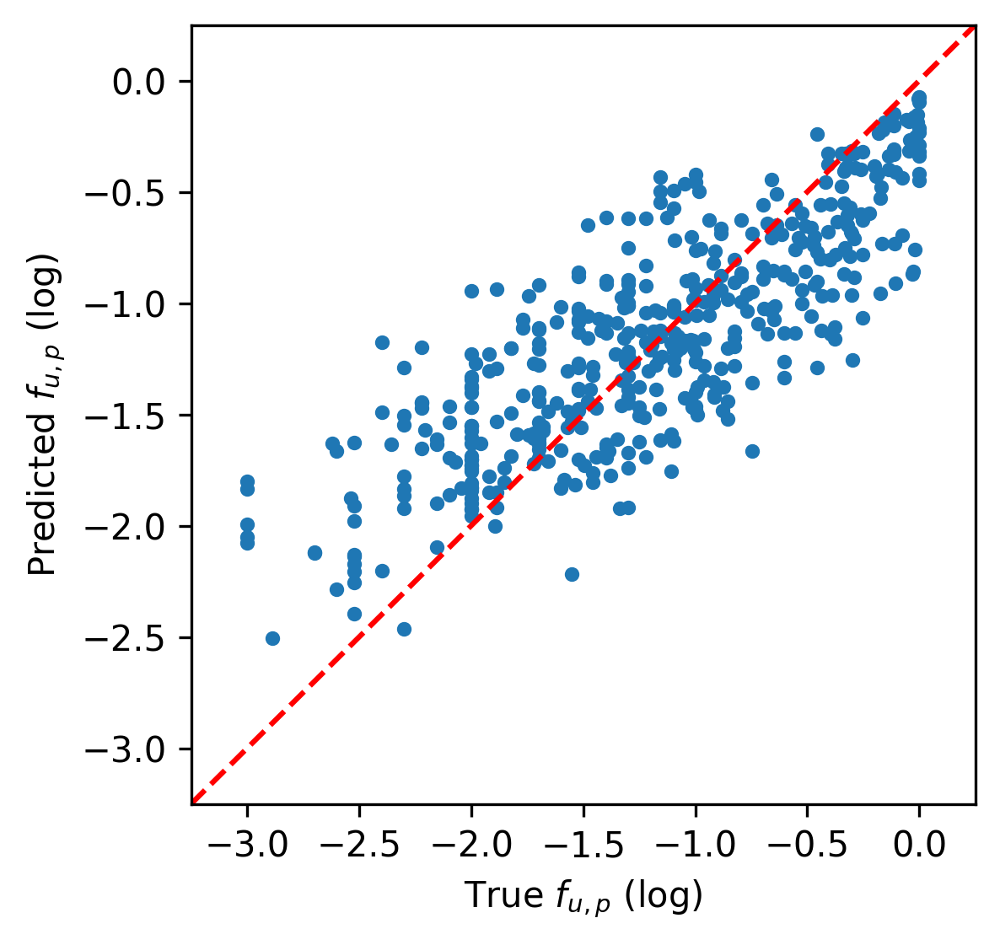
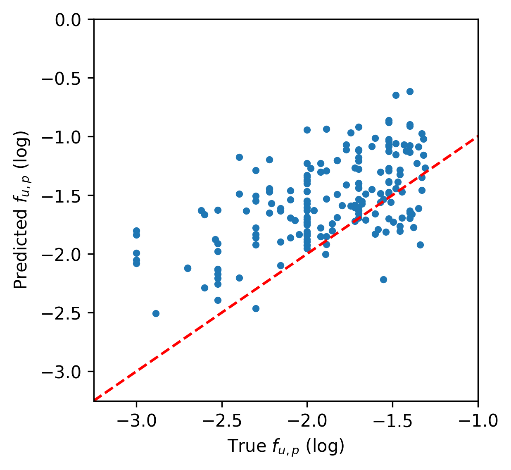

# MP-Watanabe-Predicting-Fup
Reproducing results from  <a href="https://pubs.acs.org/doi/10.1021/acs.molpharmaceut.8b00785" target="_blank">Watanabe, Reiko, et al.</a> "Predicting fraction unbound in human plasma from chemical structure: improved accuracy in the low value ranges." Molecular pharmaceutics 15.11 (2018): 5302-5311.

## Setup
We provide a script for automatically building the required conda environment. However, the steps in the script can also be run manually as shown below. You must also install JRE 6+ in order to use padelpy. We provide the precalculated descriptors and fingerprints so users do not need to repeat that computationally intensive step or cannot do so due to operating system constraints.

### Automatic
There is a Windows batch script for creating the required conda environment in the ```build/``` folder. You will need to modify the first line to point to your Anaconda or Miniconda installation folder before running the batch script.
```batch
set CONDAPATH=PATH\TO\Anaconda3
```

### Manual
You can also install the packages manually. It is recommended to follow the installation order in the batch script. Some of the dependencies are broken due to the age of some of the packages; installing them in the order provided produces a working environment. 

```bash
conda env remove --name watanabe-env -y

conda create --name watanabe-env python=3.9 -y --copy

conda activate watanabe-env

pip install rdkit mordred Boruta padelpy

pip install numpy==1.19.5 pandas matplotlib joblib black
```

## Reproducing Results
The results will need to be reproduced sequentially as the Morded descriptors and PaDEL fingerprints are only calculated once and then cached in the ```data/``` folder. Additionally, the descriptor down-selection with the Boruta package only happens once and the down-selected descriptors are cached in the ```data/``` folder. These two steps are run in the ```run/train_log_d1_rf.py``` script. Finally, the trained model is saved at the end of the script and is required for the ```run/eval_log_d1_rf_opera.py``` script. Therefore, that script must be run once first before any of the other results scripts.

### Training Random Forest Regressor with D1 Descriptors

<div align="center">
<figure>

<br>
<figcaption>Parity plot of log-D1-RF results from run/train_log_d1_rf.py</figcaption>
</figure>
</div>
<br>
<div align="center">
<figure>

<br>
<figcaption>Parity plot of log-D1-RF results in the low value region from run/train_log_d1_rf.py</figcaption>
</figure>
</div>
